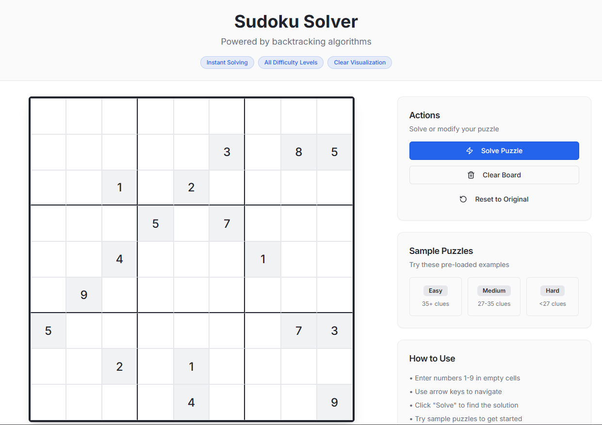
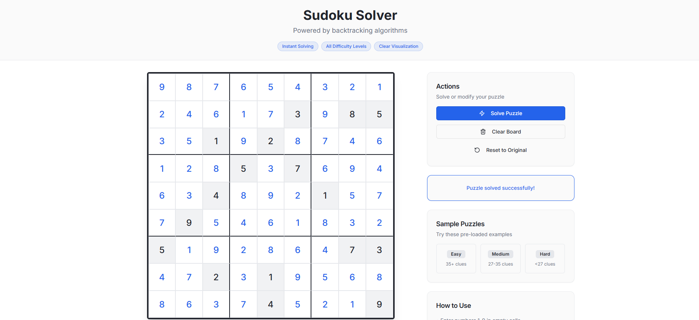

# Full-Stack Sudoku Solver Web App

A comprehensive documentation for the **Full-Stack Sudoku Solver**, an end-to-end web application that enables users to input, validate, and solve Sudoku puzzles using a powerful recursive backtracking algorithm.  
This document outlines the project structure, setup process, logic flow, and API usage.

---

## 1. Overview

The Sudoku Solver Web App is a **full-stack application** composed of:

- **Frontend:** React (with Vite) for building an interactive Sudoku UI.
- **Backend:** Express + TypeScript for managing routes, API endpoints, and solver execution.
- **Solver Logic:** Implemented in pure JavaScript with a backtracking algorithm.

It provides an intuitive user interface to input puzzles, validate them client-side, and request automated solutions from the backend.

---

## 2. Architecture Overview

### Frontend
- Built with **React** and served using **Vite**.
- Contains the **SudokuGrid** component for rendering the 9×9 board.
- Includes a **ControlPanel** for user actions such as solving, clearing, and validating puzzles.

### Backend
- Powered by **Express**.
- Handles client requests for Sudoku validation and solving.
- Integrates with Vite for development mode using `setupVite`.

### Solver
- Located in `sudoku-solver.js`.
- Uses **recursive backtracking** to compute valid solutions.
- Returns structured responses with either a solved board or an error message.

---

## 3. Project Structure

```
root/
├── client/
│   ├── index.html
│   ├── src/
│   │   ├── App.jsx
│   │   ├── components/
│   │   │   ├── SudokuGrid.jsx
│   │   │   └── ControlPanel.jsx
│
├── server/
│   ├── index.ts
│   ├── routes.ts
│   ├── vite.ts
│   ├── sudoku-solver.js
│   └── schema.ts
│
├── screenshots/
│   ├── main.png
│   └── Solved.png
│
├── package.json
├── vite.config.ts
├── tsconfig.json
└── tailwind.config.ts
```

---

## 4. Solver Logic

### Key Functions

| Function | Purpose |
|-----------|----------|
| **isValidSudoku(board)** | Validates the Sudoku board structure and initial configuration. |
| **isValid(board, row, col, num)** | Checks whether a number can be placed at a specific position. |
| **findEmptyCell(board)** | Finds the next unfilled cell in the board. |
| **solveSudoku(board)** | Recursive function implementing the backtracking algorithm. |
| **solve(board)** | Public entry point: validates input, copies the board, and attempts to solve it. |

### Algorithm Flow

1. Identify the next empty cell (`0`).
2. Iterate through numbers 1–9.
3. For each valid placement, fill the cell and recursively call `solveSudoku`.
4. If recursion fails, backtrack by resetting the cell.
5. Continue until all cells are filled or no valid placements remain.

---

## 5. Data Flow

### Step 1: User Interaction
- Users input Sudoku numbers through the **SudokuGrid**.
- The **ControlPanel** component triggers client-side validation or server API calls.

### Step 2: API Request
- The frontend sends the current Sudoku board to `/api/validate` or `/api/solve`.

### Step 3: Server Processing
- The Express server invokes the solver module.
- The result is sent back as a structured JSON response.

### Step 4: UI Update
- The React UI displays either an error or the solved Sudoku grid.

---

## 6. Screenshots

### Main Interface


### Solved Sudoku


---

## 7. Installation Guide

### Prerequisites
- Node.js (v16 or above)
- npm

### Steps

```bash
# Clone the repository
git clone https://github.com/your-username/sudoku-solver-fullstack.git
cd sudoku-solver-fullstack

# Install dependencies
npm install

# Start the development server
npm run dev
```

Visit [http://localhost:3000](http://localhost:3000) to open the application.

---

## 8. API Reference

### **POST /api/solve**
Solves a Sudoku board.

**Request Body:**
```json
{
  "board": [[5,3,0,0,7,0,0,0,0], [6,0,0,1,9,5,0,0,0], ...]
}
```

**Response:**
```json
{
  "success": true,
  "solution": [[5,3,4,6,7,8,9,1,2], ...]
}
```

### **POST /api/validate**
Validates a Sudoku configuration.

**Response Example:**
```json
{
  "success": false,
  "message": "Duplicate value found in row 3"
}
```

---

## 9. Configuration Files

| File | Description |
|------|--------------|
| `package.json` | Project dependencies and scripts |
| `vite.config.ts` | Vite setup and integration |
| `tsconfig.json` | TypeScript configuration |
| `tailwind.config.ts` | Tailwind CSS styling configuration |

---

## 10. Design Guidelines

Refer to `design_guidelines.md` for:

- Component structure and grid layout.
- Responsive design principles.
- Color schemes and accessibility standards.

---

## 11. Technology Stack

| Category | Technology |
|-----------|-------------|
| Frontend | React, Vite, Tailwind CSS |
| Backend | Express, TypeScript |
| Logic | JavaScript (Backtracking Algorithm) |
| Dev Tools | Node.js, Vite, ESLint |

---
